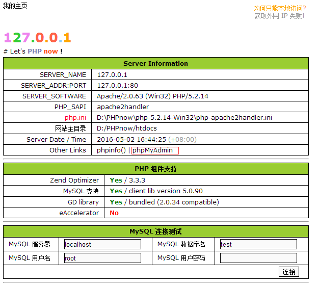

# 10-WEB安全基础

## 基础知识

### HTTP协议 

超文本传输协议`HTTP`，`HyperText Transfer Protocol`。设计HTTP最初的目的是为了提供一种发布和接收HTML页面的方法。通过HTTP或者HTTPS协议请求的资源由统一资源标示符（`Uniform Resource Identifiers`）来标识

### HTML

超文本标记语言Html的结构包括`Head`--提供关于网页的信息 / `Body`提供网页的具体内容
|符号|含义|
|:--|:--|
|`<head>`|	定义了文档的信息|
|`<title>`|	定义了文档的标题|
|`<base>`|	定义了页面链接标签的默认链接地址|
|`<link>`|定义了一个文档和外部资源之间的关系|
|`<meta>`|	定义了HTML文档中的元数据|
|`<script>`|	定义了客户端的脚本文件|
|`<style>`|	定义了HTML文档的样式文件|
|`<body></body>`|正文标记符 / 实体标记|

### COOKIE

`Cookie` / `Cookies`，指某些网站为了辨别用户身份、进行session跟踪而储存在用户本地终端上的数据，通常经过加密

`Cookie`由服务器端生成，发送给`User-Agent`（一般是浏览器），浏览器会将`Cookie`的`key/value`保存到某个目录下的文本文件内，下次请求同一网站时就发送该`Cookie`给服务器（如果浏览器设置为启用`cookie`的话）。`Cookie`名称和值可以由服务器端自己定义，服务器可以知道该用户是否是合法用户以及是否需要重新登录等，服务器可以设置或读取`Cookies`中包含信息，借此维护用户跟服务器会话中的状态。

生存周期：`Cookie`可以保持登录信息到用户下次与服务器的会话。还有一些`Cookie`在用户退出会话的时候删除，保护个人隐私。

跨站`Cookie`：实际上，`Cookie`中保存的用户名、密码等个人敏感信息通常经过加密，很难将其反向破解。但这并不意味着绝对安全，黑客可通过木马病毒盗取用户浏览器`Cookie`，直接通过偷取的`Cookie`骗取网站信任。

自`Cookie`诞生以来，其就拥有专属性原则，即A网站存放在`Cookie`中的用户信息，B网站是没有权限直接获取的。但是，一些第三方广告联盟的代码使用范围很广。这就造成用户在A网站搜索了一个关键字，用户继续访问B网站，由于B网站也使用了同一家的第三方广告代码，这个代码可以从`Cookie`中获取用户在A网站的搜索行为，进而展示更精准的推广广告。

### Javascript

点击右键显示“你好”，点击左键显示禁止复制 

```html
<html>
<head>
<title></title>
  <script type="text/javascript">
    function MyClick() 
    {
      if (event.button ==1) { alert("你好");}
      else if (event.button ==2) { alert("禁止复制");}
      else { setTimeout("close();", 2000); }
    }
    function close() { window.opener =null; window.close(); }
  </script>
</head>
<body onmouseup="MyClick()"> </body>
</html>
```
## WEB编程示例

### WEB服务环境安装 

`PHPnow` -- 解压后执行 `Setup.cmd` 初始化，即可得到一个 `PHP` + `MySQL` 环境。点击 `PnCp.cmd`，选择序号20，即可启动`PHPnow`。访问`http://127.0.0.1`----



点击`phpMyAdmin`，将进入数据库管理界面，可以自行创建数据库、表以及录入数据等

### 第一个php程序 
`Dreamweaver`编辑一个静态网页`login.htm`，存储到`PHPnow\htdocs`下。(`htdocs`是`PHPnow`的`web`应用的根目录)

login.htm
```html
<html>
<body>
<form id="form1" name="form1" method="post" action="loginok.php">
  <table width="900" border="0" cellspacing="0" cellpadding="0">
    <tr>
      <td height="20">姓名</td>
      <td height="20"><label>
        <input name="username" type="text" id="username" />
      </label></td>
    </tr>
    <tr>
      <td height="20">口令</td>
      <td height="20"><label>
        <input name="pwd" type="password" id="pwd" />
      </label></td>
    </tr>
    <tr>
      <td height="20">&nbsp;</td>
      <td height="20"><label>
        <input type="submit" name="Submit" value="提交" />
      </label></td>
    </tr>
  </table>
</form>
</body>
</html>
```
一个form表单--两个input + 一个submit

用户单击确认按钮submit，表单的内容会被传送到另一个文件。表单的动作属性`action`定义了目的文件的文件名，即`loginok.php`。

Http定义了与服务器交互的不同方法，最基本的有`GET` / `POST` / `PUT` / `DELETE`。`GET`一般用于获取/查询资源信息，`POST`一般用于更新资源信息

`POST`和`GE`的区别： 
- `GET`请求的数据会附在`URL`之后，以`?`分割`URL`和传输数据，参数之间以`&`相连，如：`login.action?name=sean&password=123`。 
- `POST`把提交的数据则放置在是`HTTP`包的包体中,安全性比`GET`高。

处理提交输入的第一个`php`文件代码如下：
```php
<?php 
 $username = $_POST['username'];
 $pwd = $_POST['pwd'];
 $SQLStr = "SELECT * FROM userinfo where username='$username' and pwd='$pwd'"; 
 echo $SQLStr ; 
?>
```

### 连接数据库

在`myDB`库中，有一个表`userinfo`，包含两个字段，即`username`和`pwd`，则程序改动如下：
```php
<?php
 $conn=mysql_connect("localhost", "root", "123456");  
 $username = $_POST['username'];
 $pwd = $_POST['pwd'];
 $SQLStr = "SELECT * FROM userinfo where username='$username' and pwd='$pwd'"; 
 echo $SQLStr ;
 $result=mysql_db_query("MyDB", $SQLStr, $conn); 
 if ($row=mysql_fetch_array($result)) 
 	  echo "<br>OK<br>";
  else 
 	  echo "<br>false<br>";
mysql_free_result($result);
mysql_close($conn);  
?>
```
登陆成功，则显示OK，否则，显示false。

### 创建cookie

`cookie`存放在客户端浏览器中，`session`保存在服务器上。联系是`session ID`一般保存在cookie中。

`Cookie`工作原理：当客户访问某个网站时，在PHP中可以使用`setcookie`函数生成一个`cookie`，系统经处理把这个`cookie`发送到客户端并保存在`c:\Documents and Settings\用户名\Cookies`目录下。`Cookie`是`HTTP`标头的一部分，因此`setcookie`函数必须在任何内容送到浏览器之前调用。当客户再次访问该网站时，浏览器会自动把`c:\Documents and Settings\用户名\Cookies`目录下与该站点对应的`cookie`发送到服务器，服务器则把从客户端传来的`cookie`将自动地转化成一个`PHP`变量。

`setcookie(name, value, expire, path, domain, secure)`
- `name` 必需。规定 cookie 的名称。
- `value` 必需。规定 cookie 的值。
- `expire` 可选。规定 cookie 的有效期。
- `path` 可选。规定 cookie 的服务器路径。
- `domain` 可选。规定 cookie 的域名。
- `secure` 可选。规定是否通过安全的 HTTPS 连接来传输 cookie。

可以通过 `$HTTP_COOKIE_VARS["user"]` 或` $_COOKIE["user"]`来访问`name`指定的 `cookie` 的值

```php
<?php
 $conn=mysql_connect("localhost", "root", "123456");  
 $username = $_POST['username'];
 $pwd = $_POST['pwd'];
 $SQLStr = "SELECT * FROM userinfo where username='$username' and pwd='$pwd'"; 
 echo $SQLStr ;
 $result=mysql_db_query("MyDB", $SQLStr, $conn);
 if ($row=mysql_fetch_array($result))
 {
 	  setcookie("uname",$username);
 	  echo "<br>OK<br>";
 	  echo $_COOKIE["uname"]; 
 } 
 else { echo "<br>false<br>";}  
mysql_free_result($result);
mysql_close($conn);  
?>
```
没有设置`COOKIE`的失效时间，这个`COOKIE`在关闭浏览器后将失效，不会保存在本地

本地保存COOKIE -- 即设置了`expires`参数，`COOKIE`的值指定了失效时间，那么这个`COOKIE` 会保存在本地，关闭浏览器后再访问网站，在`COOKIE`有效时间内所有的请求都会带上这个本地保存`COOKIE`。

```php
<?php 
if ($_COOKIE["uname"]==null)
  echo "should cookie";
else
  echo "ok";
?>
```
如果一个页面依赖于某个`cookie`，而`cookie`的值被泄露后，即使没有登录，也可能利用该`cookie`来访问该页面，这就是`cookie`在客户端不安全引发的后果。

## WEB安全威胁

### 遭破坏的身份认证和会话管理

**遭破坏的认证和会话管理** : 攻击者窃听了用户访问`HTTP`时的用户名和密码 / 用户的会话得到`sessionID`-- 冒充用户进行`HTTP`访问的过程

`SessionID`是用户访问请求的凭证,然而很容易在网络上被嗅探到，这种形式的攻击主要针对身份认证和会话

#### 密码的安全性

弱口令--字典攻击破解

#### 用户的认证必须通过加密信道进行传输

样例分析
```s
POST http://www.example.com/login HTTP/1.1
Host: www.example.com
User-Agent: Mozilla/5.0 (Windows NT 5.2; rv:16) Gecko/20100101 Firefox/16.0
Accept: text/xml,application/xml,application/xhtml+xml
Accept-Language: it-it,it;q=0.8,en-us;q=0.5,en;q=0.3
Accept-Encoding: gzip,deflate
Accept-Charset: ISO-8859-1,utf-8;q=0.7,*;q=0.7
Keep-Alive: 300
Connection: keep-alive
Referer: http://www.example.com/index.jsp
Cookie:
JSESSIONID=LVrRRQQXgwyWpW7QMnS49vtW1rEdqn98CGlkP4jTvVCGdyPkmn3S!
Content-Type: application/x-www-form-urlencoded
Content-length: 64
delegated_service=218&User=test&Pass=test&Submit=SUBMIT
```
啧啧啧，就很容易得到用户名test和密码test

如果利用Get方法通过HTTPS来传递数据,用户名和密码都以明文的方式在URL里存在

#### 会话与认证

密码与证书等认证手段，一般仅用于登录过程。当登录完成后，不会每次浏览器请求访问页面时都使用密码进行认证。因此，当认证成功后，就使用一个对用户透明的凭证`SessionID`进行认证。当用户登录完成后，服务器端就会创建一个新的会话`Session`。会话中会保存用户的状态和相关信息。服务器端维护所有在线用户的`Session`，此时的认证，只需要知道哪个用户在浏览当前的页面即可。为使服务器确定应该使用哪个`Session`，用户的浏览器要把当前用户持有的`SessionID`传给服务器。最常见的做法就是把`SessionID`加密后保存在`Cookie`中传给服务器。

`SessionID`一旦在生命周期内被窃取，就等于账户失窃。由于`SessionID`是用户登录持有的认证凭证，因此黑客不需要再想办法通过用户名和密码进行登录，而是直接使用窃取的`SessionID`与服务器进行交互。

会话劫持就是一种窃取用户`SessionID`后，使用该`SessionID`登录进入目标账户的攻击方法，此时攻击者实际上是利用了目标账户的有效`Session`。如果`SessionID`是被保存在`Cookie`中，则这种攻击被称为`Cookie`劫持。

 `SessionID`除了可以保存在`Cookie`中，还可以作为请求的一个参数保持在`URL`中传输。由于很多手机浏览器暂不支持`Cookie`，所以只能将`SessionID`作为`URL`的一个参数传输以进行认证。手机浏览器在发送请求时，一旦`SessionID`泄漏，将直接导致信息外泄。

#### 会话保持攻击

`Session`是有生命周期的，当用户长时间未活动后，或者用户点击退出后，服务器将销毁`Session`。如果攻击者窃取了用户的`Session`，并一直保持一个有效的`Session`（比如间隔性地刷新页面，以使服务器认为这个用户仍然在活动），而服务器对于活动的`Session`也一直不销毁，攻击者就能通过此有效`Session`一直使用用户的账户，即成为一个永久的“后门”，这就是会话保持攻击。

在一定的时间后，强制销毁`Session`。但是强制销毁`Session`可能会影响到一些正常的用户，还可以使用的方法是当用户客户端发生变化时，系统要求用户重新登陆，比如用户的IP、用户代理等信息发生改变时，就可以强制销毁当前的`Session`，并要求用户重新登陆。

### 不安全的直接对象引用

#### 概念
`Direct Object Reference`简称`DOR`，即直接对象引用，是指`WEB`应用程序的开发人员将一些不应公开的对象引用直接暴露给用户，使得用户可以通过更改`URL`等操作直接引用对象

不安全的直接对象引用就是指一个用户通过更改`URL`等操作可以成功访问到未被授权的内容。比如一个网站上的用户通过更改`URL`可以访问到其他用户的私密信息和数据等。

#### 原理

示例
```php
String query=”SELECT * FROM accts WHERE account=?”;
PreparedStatement pstmt=connection.prepareStatement(query, ...);
pstmt.setString(1,request.getParameter(“acct”));
ResultSet results=pstmt.executeQuery();
```
代码并没有进行任何的验证，修改`acct`参数的值能访问到其他用户的信息。

#### 攻击步骤

1. 首先判断Web网站是否有泄漏直接对象引用给用户，如果在整个Web网站中未发现直接对象引用，则不存在此威胁
2. 更改URL等操作，尝试访问非授权的数据，如果Web网站没有进行访问控制，即可获取Web网站非授权数据。

#### 防范措施

- 避免将私密的对象引用直接暴露给用户。
- 在向用户提供访问之前进行认证和审查，实行严格的访问控制。

### 安全配置错误

有各种各样的安全配置错误，比如，未能及时对各个层次的软件进行更新，默认的用户名密码没有及时修改，对于不必要的功能和服务没有及时的进行关闭甚至卸载，一些安全项配置不合理等都有可能导致Web应用系统被攻击。

防止安全配置错误
- 及时将各个软件更新到最新状态
- 采用安全的系统框架，对Web系统的各个组件进行分离
- 定时对Web系统进行扫描，以发现可能存在的配置错误。

尽可能的将Web应用系统的各个方面都做好安全配置。

### 不安全的加密存储

不安全的加密存储 指Web应用系统没有对敏感性资料进行加密，或者采用的加密算法复杂度不高可以被轻易破解，或者加密所使用的密钥非常容易检测出来。

为了防止不安全的加密存储

- 对于所有的敏感性数据必须进行加密，且无法被轻易破解
- 保证加密密钥被妥善保管，攻击者不能轻易窃取，并准备密钥的定期更换
- 对于敏感存储内容必须进行严格的访问控制，只允许授权用户进行操作

### 没有限制的URL访问

在某些情况下攻击者能够访问被隐藏了的链接，从而可以使用未被授权的功能

为了防止未经授权的URL访问，可以对每一个页面加上适当的授权和认证机制。对于每一个URL链接必须要配置一定的防护措施
- 要隐藏的链接必须能限制非授权用户的访问
- 加强基于用户或者角色的访问控制
- 禁止访问一些私密的页面类型。

### 传输层保护不足

SSL -- 实现Internet上数据传输的安全,当传输层没有进行安全保护时

#### 会话劫持

服务器为了识别用户连接，服务器会发送给客户端`SessionID`。如果传输层保护不足，攻击就可以通过嗅探的方法获取传输内容，提取`SessionID`，冒充受害者发送请求。

#### 中间人攻击

中间人攻击(`Man-in-the-middle attack`)，即`MITM`。如果传输层保护不足，攻击者可以担任中间人的角色，在用户和Web服务器之间截获数据并在两者之间进行转发，使用户和服务器之间的整个通信过程暴露在攻击者面前

- 将所有的敏感页面采用SSL技术加密传输，将未采用SSL的请求转向SSL页面
- 后台或者其他链接也应该使用SSL或者其他加密技术
- 在使用SSL协议时，需要确保数字证书的有效性

### 未验证的重定向及转发

如果没有经过验证，攻击者就能够将其他用户引导到特定的站点，未经过验证的重定向将可能使用户被引导到钓鱼网站或者挂马网站等恶意站点，而未经过验证的转发将可能导致用户绕过验证和授权机制。

防范
- 尽量避免使用重定向和转发
- 使用重定向和转发要避免通过参数获得地址
- 如果必须使用目标地址，必须校验地址，并加强授权和认证
